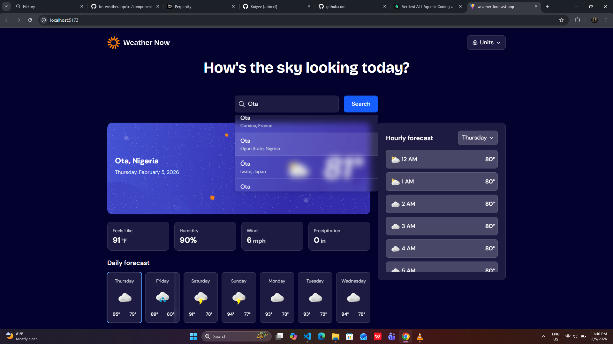
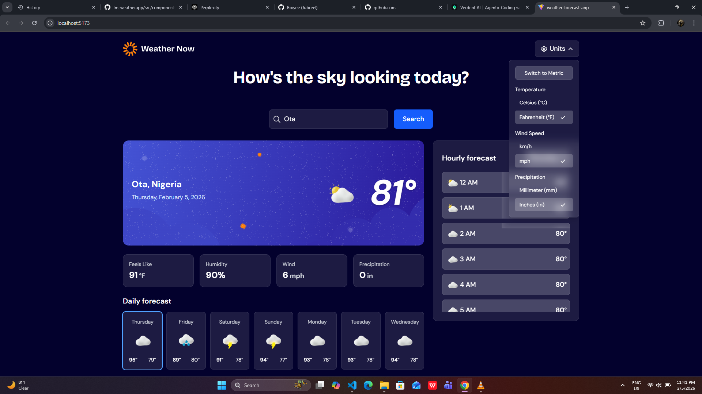

# Frontend Mentor - Weather app solution

## Table of contents

- [Overview](#overview)
  - [The challenge](#the-challenge)
  - [Screenshot](#screenshot)
  - [Links](#links)
- [My process](#my-process)
  - [Built with](#built-with)
  - [What I learned](#what-i-learned)
  - [Continued development](#continued-development)
  - [Useful resources](#useful-resources)
- [Author](#author)
- [Acknowledgments](#acknowledgments)

## Overview

### The challenge

Users should be able to:

- Search for weather information by entering a location in the search bar
- View current weather conditions including temperature, weather icon, and location details
- See additional weather metrics like "feels like" temperature, humidity percentage, wind speed, and precipitation amounts
- Browse a 7-day weather forecast with daily high/low temperatures and weather icons
- View an hourly forecast showing temperature changes throughout the day
- Switch between different days of the week using the day selector in the hourly forecast section
- Toggle between Imperial and Metric measurement units via the units dropdown 
- Switch between specific temperature units (Celsius and Fahrenheit) and measurement units for wind speed (km/h and mph) and precipitation (millimeters) via the units dropdown
- View the optimal layout for the interface depending on their device's screen size
- See hover and focus states for all interactive elements on the page

### Screenshot




### Links

- Solution URL: [Live Solution URL](https://prod.liveshare.vsengsaas.visualstudio.com/join?D2F4A93C84D23F9908A0AF76449DDA000BEF)
- Live Site URL: [Live URL](https://qj747lw4-5173.uks1.devtunnels.ms/)
- Live Site URL: [Live]( https://boiyee.github.io/Weather-forecast-app/)

## My process

### Built with

- Semantic HTML5 markup
- CSS custom properties
- CSS Flex
- CSS Grid
- [React](https://reactjs.org/) - JS library
- Tailwind

### What I learned

Formulating can take days, but once done. You can keep coding for however long it may take.

To see how you can add code snippets, see below:

```css
<button
 onClick={() => setIsDropdownOpen(!isDropdownOpen)}
 className="flex items-center space-x-2 glass-card px-3 py-2 rounded-lg hover:bg-white/20 transition-all duration-200">
```
```js
// Fetch weather data from Open-Meteo API
export const fetchWeatherData = async (lat, lon, units = "metric") => {
  const tempUnit = units === "metric" ? "celsius" : "fahrenheit";
  const windSpeedUnit = units === "metric" ? "kmh" : "mph";
  const precipitationUnit = units === "metric" ? "mm" : "inch";


  const url = `https://api.open-meteo.com/v1/forecast?latitude=${lat}&longitude=${lon}&current=temperature_2m,relative_humidity_2m,apparent_temperature,precipi

  const response = await fetch(url);
  if (!response.ok) {
    throw new Error("Failed to fetch weather data");
  }

  return response.json();
};

```

### Continued development

Mobile-applications

### Useful resources

- [Ticket Generator](https://boiyee.github.io/Ticket-Generator/) - This helped me for XYZ reason. I really liked this pattern and will use it going forward.
- [Weather-app]( https://github.com/Boiyee/Weather-app) - This is an amazing article which helped me finally understand XYZ. I'd recommend it to anyone still learning this concept.

## Author

- Website - [Boiyee](https://github.com/Boiyee)
- Frontend Mentor - [@Boiyee](https://www.frontendmentor.io/profile/Boiyee)
- Twitter - [@OduwaleJubreel](https://www.twitter.com/OduwaleJubreel)

## Acknowledgments

Thanks to consistency, Youtube and me.
